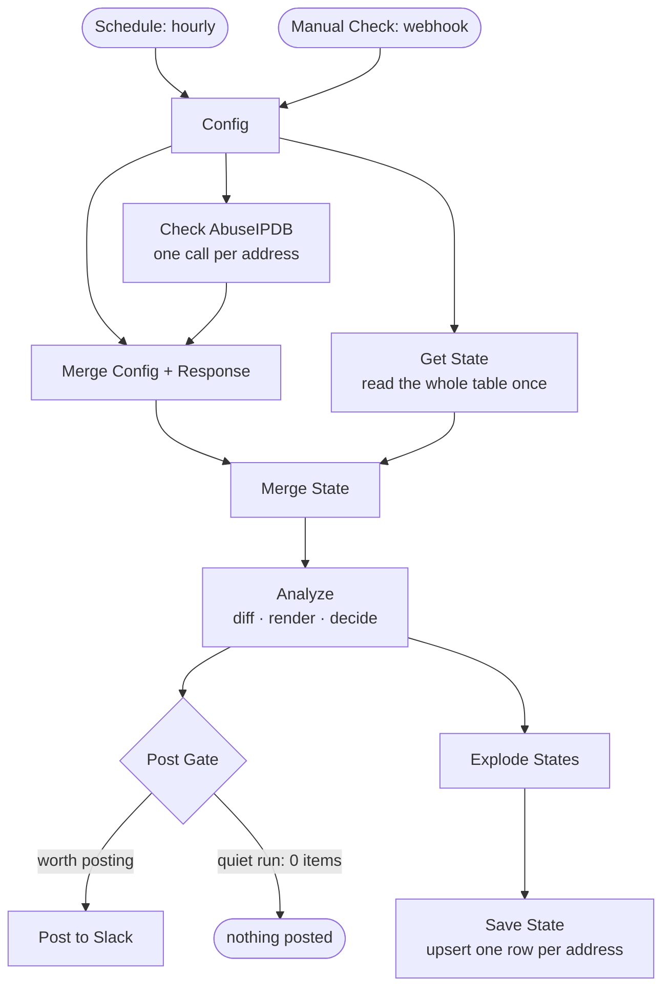

# AbuseWatch — watch your own IPs on AbuseIPDB, report to Slack

An [n8n](https://n8n.io) workflow that checks **your own public IP addresses** against
[AbuseIPDB](https://www.abuseipdb.com) every hour and tells you in **Slack** the moment
somebody starts reporting them — plus one "all clean" recap a day, so silence is never
ambiguous.

## Why you'd want this

AbuseIPDB is where operators file the abuse reports that feed blocklists, mail reputation
systems and firewall rules. When an address of yours starts appearing there, it usually
means one of three things, none of which you find out about on your own:

- **A machine behind that address is compromised** and is now attacking other people —
  FTP/SSH brute force, port scanning, spam. The victims report it; you don't see it.
- **Your reputation is being burned.** Once the confidence score climbs, mail gets
  rejected, APIs start returning 403, and your users blame you.
- **Someone else is using the address** — a stale DNS entry, a recycled cloud IP, a
  neighbour on the same CGNAT egress.

The usual way to discover any of this is that something breaks days later. This workflow
turns it into a Slack message within the hour, carrying each report's category, reporter
country and comment — so you see *what* is being reported (an FTP brute-force jail
tripping, a port scan, a web-app attack) and can go straight to the right host and
service.

It is deliberately **read-only and boring**: it watches, diffs and reports. It never
submits anything to AbuseIPDB, changes firewall rules, or touches the hosts.

## What it posts

New reports — immediately, any hour:

```
🚨 *AbuseWatch* — new abuse reports · 2026-09-12 17:51 ET

*<https://www.abuseipdb.com/check/203.0.113.10|Home>* `203.0.113.10` — confidence 0%, 0 reports in 90d — no new reports

*<https://www.abuseipdb.com/check/198.51.100.25|Web server>* `198.51.100.25` — confidence 44%, 3 reports in 90d · *1 new*
• `2026-09-12 05:30 ET` Web App Attack [CN] — _POST /wp-login.php ..._
```

Nothing new — silent, except one recap a day:

```
✅ *AbuseWatch* — all clean · 2026-09-12 16:00 ET

*<https://www.abuseipdb.com/check/203.0.113.10|Home>* `203.0.113.10` — confidence 0%, 0 reports in 90d — no new reports
*<https://www.abuseipdb.com/check/198.51.100.25|Web server>* `198.51.100.25` — confidence 44%, 3 reports in 90d, last 2026-09-12 05:30 ET — no new reports

_Checked hourly; this recap posts once a day, from 4pm ET._
```

And, when the check itself is broken (dead API key, blown quota, network):

```
⚠️ *AbuseWatch* — AbuseIPDB checks are failing · 2026-09-12 17:51 ET

⚠️ *<https://www.abuseipdb.com/check/203.0.113.10|Home>* `203.0.113.10` — check failed (3 runs in a row): 401: Authentication failed
_Check the AbuseIPDB API key credential and the daily quota._
```

The reporting contract in full:

| Situation | Slack |
|---|---|
| New reports since the previous check | post immediately, with categories and comments |
| Nothing new | **nothing**, except the daily recap |
| Daily recap (from 16:00 local, once a day) | "all clean", so you know it is still running |
| A watched address checked for the first time | one "baseline recorded" message, then silence |
| Check failed 1–2 times in a row | nothing (transient failures are noise) |
| Check failed 3 times in a row | alert once, then at most once a day |

## How it works



12 nodes, one workflow, no external services beyond AbuseIPDB and the Slack webhook.

| Node | Job |
|---|---|
| `Config` | **The only place you edit.** A `WATCHED` list of `{ ip, label }`; everything downstream fans out from it. |
| `Check AbuseIPDB` | One `GET /api/v2/check` per address. `onError: continueRegularOutput` so a failure still emits an item and the branch stays aligned by position. |
| `Get State` | Reads the whole state table in one shot (`executeOnce`, no filters). |
| `Merge Config + Response` | Re-attaches `ip`/`label` to each response, by position. |
| `Analyze` | Everything stateful: diffs reports, renders the Slack text, decides whether the run is worth posting. |
| `Post Gate` | Returns **zero items** on a quiet run, which stops the branch. That is how the workflow stays silent without an IF node. |
| `Save State` | Upserts one row per address, matched on `ip`. Runs on **every** execution, including silent ones. |

### How "new" is decided

Each report is fingerprinted as `reportedAt|reporterId`. The state row keeps the full set
of fingerprints currently inside the API's `maxAgeInDays` window, as a JSON array in
`seen_keys`.

- **New reports** = fingerprints in this response that are not in `seen_keys` — so "new"
  means *new since the last check*, not "new today". Nothing is repeated, nothing is
  missed between runs.
- The set **self-prunes**: it is replaced each successful run by whatever the API
  returned, and the API only returns reports inside the window, so it cannot grow without
  bound.
- **Baseline rule:** an address with a blank `seen_keys` has never been read successfully.
  Its first good read is recorded as a baseline and reports nothing as "new" — adding an
  address does not dump its entire back catalogue into Slack.
- **A failed check never overwrites good state.** On failure the previous `seen_keys`,
  `total_reports` and `last_reported_at` are carried forward untouched; only `fail_streak`
  and `last_error` move. Otherwise the next successful run would re-report everything.
- **Fallback:** if `reports[]` is ever absent (a non-verbose response), the diff falls back
  to comparing `totalReports` against the stored count and says detail is unavailable.

### Why the recap is date-stamped, not hour-matched

n8n's Schedule Trigger does **not** backfill a missed tick. Keyed on "the hour is exactly
16", an instance that happened to be down or restarting at 16:00 would simply skip that
day's recap — and the recap exists precisely so that silence can be read as "checked and
clean". So the rule is **"16:00 local or later, and today's recap has not gone out yet"**.
The date of the last recap lives in the `last_digest_on` column. Normally it fires at
16:00; after an outage it catches up on the next run.

### Why the API and not the `/check/` page

`https://www.abuseipdb.com/check/<ip>` sits behind Cloudflare and returns **403** to any
server-side fetch — and scraping it would be against AbuseIPDB's terms. The workflow uses
**API v2** (`GET https://api.abuseipdb.com/api/v2/check`), a documented free endpoint that
returns exactly what the diff needs.

- `?ipAddress=<ip>&maxAgeInDays=90&verbose` — `verbose` is a **bare presence flag** (no
  `=value`), which is why the whole query string is built into the node's URL rather than
  through "Send Query Parameters".
- Free tier is **1,000 checks/day**. Cost is `addresses × 24` per day: two addresses = 48,
  so there is room for roughly 40 watched addresses before quota matters.

### Noise control

- Transient failures are silent. Slack is told only after **3 consecutive failures**
  (`FAIL_ALERT_AFTER`), and then at most **once a day** (`FAIL_RENAG_EVERY = 24`).
- Report bullets are capped at `MAX_BULLETS = 8` per address, with an "…and N more" line.
- Reporter comments are attacker-influenced free text. They are **Slack-escaped**
  (`&`, `<`, `>`), flattened to one line and clipped to 160 characters, so a comment
  cannot inject a fake link or a mention into your channel.

## Repository layout

| File | Purpose | Committed? |
|---|---|---|
| `workflows/abuse-report-watcher.json` | The workflow, importable. Deployment values are `<<PLACEHOLDERS>>`; the credential is referenced by name only — **no secrets**. | ✅ |
| `tools/create-datatable.sh` | Creates the n8n Data Table with the exact schema the workflow expects. | ✅ |
| `tools/build-deploy.sh` | Renders the placeholders from `.env` into an importable `deploy.workflow.json`. | ✅ |
| `tools/test-analyze.js` | Dependency-free test harness for the `Analyze` node. | ✅ |
| `.env.template` | Documents every value you must supply. Copy to `.env`. | ✅ |
| `.mcp.json` | Optional: lets Claude Code manage this workflow via the n8n MCP server. | ✅ |
| `CLAUDE.md`, `CLAUDE/REQUIREMENTS.md` | Maintainer/agent notes: design decisions and the requirements they came from. | ✅ |
| `STATE.md` | Project status: what is built, what is verified, known gaps, possible next steps. | ✅ |
| `.env` | Your real secrets and coordinates. | ❌ gitignored |
| `deploy.workflow.json` | Rendered deploy artifact (carries the real webhook URL). | ❌ gitignored |

## Prerequisites

- A running **n8n** instance (self-hosted or cloud) with **Data Tables** available.
- An **AbuseIPDB account** and a free **API v2 key**.
- A **Slack Incoming Webhook** URL (Slack → *Apps → Incoming Webhooks → Add to a channel*).
- Outbound access from n8n to `api.abuseipdb.com` and `hooks.slack.com`.

Nothing needs to reach *into* your network: the workflow polls outward. The one inbound
path is the optional manual-trigger webhook.

## Setup

### 1. Get an AbuseIPDB API key

1. Register / sign in at <https://www.abuseipdb.com>.
2. Go to <https://www.abuseipdb.com/account/api> → **Create Key**.
3. Copy the key. It stays visible on that page, so it can be re-read later rather than
   only at creation time.

### 2. Configure locally

```bash
cp .env.template .env
# edit .env: N8N_API_URL, N8N_API_KEY, SLACK_WEBHOOK_URL, MANUAL_WEBHOOK_PATH, …
```

`.env` is gitignored and is this deployment's single source of truth.

### 3. Create the Data Table

The workflow keeps its cross-run memory in an n8n **Data Table**. Create it with the
helper (it reads `N8N_API_URL` / `N8N_API_KEY` from `.env`):

```bash
./tools/create-datatable.sh            # or: ./tools/create-datatable.sh my_table_name
# → DATATABLE_ID=xxxxxxxxxxxxxxxx      # put this into .env
```

Or create it by hand in the n8n UI (**Data Tables → New**) with exactly these columns:

| Column | Type | Holds |
|---|---|---|
| `ip` | string | the watched address (the upsert key) |
| `label` | string | its human name |
| `last_check_at` | string | ISO timestamp of the last run |
| `last_reported_at` | string | newest report timestamp seen |
| `total_reports` | number | report count in the window |
| `abuse_score` | number | AbuseIPDB confidence % |
| `seen_keys` | string | JSON array of `reportedAt\|reporterId` fingerprints |
| `fail_streak` | number | consecutive failed checks |
| `last_error` | string | last failure message |
| `last_digest_on` | string | date of the last daily recap (`YYYY-MM-DD`) |

> n8n's public API **cannot add a column to an existing Data Table**. A schema change
> means creating a new table and repointing the two Data Table nodes at it.

### 4. Create the n8n credential

In n8n → **Credentials → New → Header Auth** (`httpHeaderAuth`), named
**`AbuseIPDB API Key`**. Three fields, and only one of them is the key:

| Field | Value |
|---|---|
| Name | `Key` — **leave alone.** This is the HTTP *header name* AbuseIPDB expects, not a label. Change it and every request 401s. |
| Value | the key itself |
| Allowed domains | `api.abuseipdb.com` — **leave alone.** Stops the key being sent anywhere else if this credential is ever attached to another HTTP node. |

Or without the browser, and without the key passing through shell history:

```bash
source .env
read -rs -p "AbuseIPDB key: " K && curl -sS -X POST \
  "$N8N_API_URL/credentials" \
  -H "X-N8N-API-KEY: $N8N_API_KEY" -H 'Content-Type: application/json' \
  -d "$(K="$K" python3 -c 'import json,os; print(json.dumps({"name":"AbuseIPDB API Key",
        "type":"httpHeaderAuth","data":{"name":"Key","value":os.environ["K"],
        "allowedHttpRequestDomains":"domains","allowedDomains":"api.abuseipdb.com"}}))')" \
  >/dev/null && unset K && echo OK
```

`read -rs` keeps the key off the terminal and out of `~/.bash_history`.

### 5. Render and import the workflow

```bash
./tools/build-deploy.sh        # → deploy.workflow.json (gitignored)
```

Then n8n → **Workflows → Import from File** → `deploy.workflow.json`. When prompted, map
the **Check AbuseIPDB** node's credential picker to *AbuseIPDB API Key*.

(You can skip the script and import `workflows/abuse-report-watcher.json` directly, then
replace the three `<<PLACEHOLDERS>>` by hand in the *Manual Check*, *Get State*, *Save
State* and *Post to Slack* nodes.)

### 6. Set your addresses and timezone

Open the **`Config`** node and replace the example addresses:

```js
const WATCHED = [
  { ip: '203.0.113.10',  label: 'Home' },
  { ip: '198.51.100.25', label: 'Web server' },
];
```

Watch only addresses you own or administer. Then set the workflow's timezone
(**Workflow menu → Settings → Timezone**) and match `TZ` / `TZ_LABEL` at the top of the
**`Analyze`** node — they drive the recap hour and every rendered timestamp.

### 7. Activate

Toggle the workflow **Active** (top right). The hourly schedule starts on the next hour.

## Usage

It runs itself. To force a check now:

```bash
source .env
curl -X POST "$MANUAL_WEBHOOK_URL"           # normal check — silent if nothing is new
curl -X POST "$MANUAL_WEBHOOK_URL?force=1"   # check and post to Slack regardless
```

`?force=1` is the smoke test: a working key produces a Slack post. A broken one shows up
as `401: Authentication failed…` in the `last_error` column of the state table, and in
Slack after three consecutive failures.

> The manual trigger has no authentication beyond an unguessable path — keep
> `MANUAL_WEBHOOK_PATH` a UUID. Worst case for a leaked path is someone making your
> workflow check your own addresses.

## Tuning

Everything tunable is a named constant at the top of a Code node:

| Where | Constant | Default | Effect |
|---|---|---|---|
| `Config` | `WATCHED` | two examples | the addresses to watch — one line each |
| `Config` | `MAX_AGE_DAYS` | `90` | AbuseIPDB report window (1–365). Drop to 30 if 90 days is noisy. |
| `Config` | `FORCE_POST` | `false` | post on every run (testing) |
| `Analyze` | `TZ` / `TZ_LABEL` | `America/New_York` / `ET` | timezone for stamps and the recap day |
| `Analyze` | `DIGEST_HOUR` | `16` | local hour from which the daily recap may post |
| `Analyze` | `FAIL_ALERT_AFTER` | `3` | consecutive failures before Slack hears about it |
| `Analyze` | `FAIL_RENAG_EVERY` | `24` | further failures between reminders |
| `Analyze` | `MAX_BULLETS` | `8` | report lines per address per message |
| `Schedule Hourly` | cron | `0 * * * *` | check frequency (watch the 1,000/day quota) |

## Testing

`tools/test-analyze.js` is a dependency-free Node harness for the `Analyze` node — the
only node with non-trivial logic. It pulls the code **out of the workflow JSON** rather
than keeping its own copy, so it always tests what is committed:

```bash
node tools/test-analyze.js
```

It covers baseline, a new report arriving, a quiet run, API failure, the non-verbose
fallback, failure-then-success recovery, the re-nag cadence, and the daily recap catching
up after a missed 16:00 tick.

Workflow *wiring* — merge alignment, `executeOnce`, Data Table upsert semantics — is n8n
runtime behaviour rather than JavaScript, so it is verified by running the workflow on an
instance and reading the execution.

## Security notes

- **No secrets in the repo.** The AbuseIPDB key lives only in n8n's encrypted credential
  store; the exported workflow references it by name. The Slack webhook, Data Table id and
  trigger path live in your gitignored `.env` and are `<<PLACEHOLDERS>>` in the committed
  JSON. If you re-export from the instance, save it as `deploy.workflow.json` (gitignored)
  or re-apply the placeholders — never commit a raw export.
- **The API key is domain-locked** to `api.abuseipdb.com` by the credential itself, so it
  cannot leak to another host even if the credential is attached to the wrong node.
- **Rotating the key:** *Create Key* issues a new one and the old one keeps working until
  you delete it, so there is no outage window. Worst case for a leaked key is someone
  burning your daily quota — the check endpoint is read-only.
- **Untrusted input is escaped.** Reporter comments come from strangers and are escaped,
  flattened and clipped before they reach Slack.

## Managing the workflow with Claude Code (optional)

`.mcp.json` wires up the [n8n MCP server](https://github.com/czlonkowski/n8n-mcp) so an
agent can read, edit, validate and run this workflow. It reads `${N8N_API_URL}` and
`${N8N_API_KEY}` from the environment, so no key is written to disk:

```bash
export N8N_API_KEY="paste-your-key-here"       # n8n → Settings → n8n API → Create an API key
export N8N_API_URL="https://your-n8n-host/api/v1"
```

`CLAUDE.md` in this repo is the agent-facing companion to this README: same system, more
detail about *why* each piece is the way it is.

> Treat the n8n API key like a password — it grants full control of the instance. If it
> leaks, revoke it in **Settings → n8n API** and create a new one.

## License

[Apache License 2.0](LICENSE).

This project is not affiliated with AbuseIPDB, Slack or n8n. Use it on addresses you own
or administer, and within [AbuseIPDB's terms of service](https://www.abuseipdb.com/legal).
